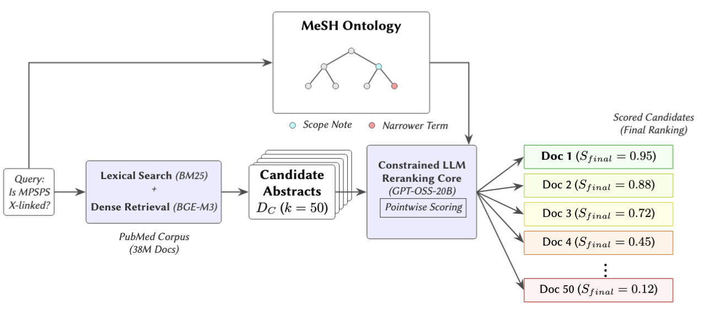

# Prompt-Based Semantic Grounding via Ontology Injection for Biomedical Document Reranking

[](#)
[](#)
[](#)

This repository contains the official code, prompt templates, and offline dataset to reproduce the RAG (Retrieval-Augmented Generation) reranking pipeline presented in our submission for **CLiC-it 2026**.

Our framework aims to improve biomedical document reranking by employing **Biomedical Concept Linking** to explicitly disambiguate query intent. We introduce a Prompt-Based Knowledge Injection strategy that leverages the Medical Subject Headings (MeSH) ontology to dynamically ground LLM relevance judgments without requiring domain-specific fine-tuning or parametric adaptation.

---

## Framework Architecture

To ensure sustainable and locally deployable evaluation, our system adopts a cascaded pipeline architecture evaluated on the BioASQ Task 13b (Phase A) dataset. 



1. **Stage 1: Hybrid Candidate Generation (Offline)**
   A lexical (BM25) and dense (BGE-M3) retrieval stage filters the 38M PubMed abstract corpus down to the top-50 candidates per query. *Note: To ensure reviewer privacy and seamless reproducibility, this stage has been decoupled. The repository provides the exact output of this stage as standalone offline JSON batches.*
2. **Stage 2: Dynamic Knowledge Injection**
   A semantic linking module matches the natural language query against the MeSH vocabulary (using SBERT 384-dim vectors). It extracts the top relevant concepts, injecting their **Scope Notes** and **Narrower Terms** into a linearized context.
3. **Stage 3: Constrained Generative Reranking**
   An instruction-tuned LLM (`GPT-OSS-20B`) acts as a pointwise relevance judge. It evaluates the candidate abstract against the query, using the injected MeSH context strictly as a supportive semantic scaffold for disambiguation. The final score is interpolated with the initial hybrid retrieval score ($\alpha=0.3$).

---

## 📂 Repository Structure

The project is designed for out-of-the-box execution. No external database connections (e.g., Qdrant) are required.

```text
repo_clic2026/
├──assets/
│   └── system.png 
├── prompts/
│   └── system_prompt.txt           # The constrained evaluation prompt for the LLM
├── src/
│   ├── 01_mesh_grounding.py        # Step 1: Injects the MeSH ontology into queries
│   ├── 02_llm_reranker.py          # Step 2: Pointwise LLM reranking via vLLM
│   ├── 03_evaluate.py              # Step 3: MAP@K evaluation stratified by difficulty
│   └── mesh_linker.py              # Helper class for Semantic Concept Linking
├── data/
│   ├── mesh/                       # MeSH ontology (SBERT vectors, hierarchy, definitions)
│   ├── 01_vectored_batches/        # Input: Top-50 candidates from Stage 1 (Hybrid)
│   ├── 02_mesh_grounded_batches/   # Output generated by Step 1
│   ├── 03_scored_batches/          # Output generated by Step 2
│   └── 04_evaluation/              # Final metrics and performance tables
├── run_pipeline.sh                 # Main execution script
└── requirements.txt                # Python dependencies
```

## ⚙️ Installation
We strongly recommend creating a fresh virtual environment (Python 3.10 or higher is required):

### Create and activate environment
```
python -m venv venv
source venv/bin/activate
```

### Install dependencies
```
pip install -r requirements.txt
```

Dependencies highlight: The pipeline relies primarily on *vllm* for accelerated LLM inference, openai-harmony for token encoding, numpy, and tqdm.

## Reproducing the Results
To execute the full end-to-end evaluation (MeSH Grounding -> LLM Reranking -> Metric Calculation) on all BioASQ batches, simply run the bash script:

```
chmod +x run_pipeline.sh
./run_pipeline.sh
```

## Evaluation Metrics
Once the pipeline finishes, the src/03_evaluate.py script will automatically calculate MAP@3, MAP@5, and MAP@10.
To isolate the impact of our ontology-grounded prompting, the metrics are automatically stratified based on upstream retrieval difficulty (Recall@50):

Hard (0% - 20%]

Medium (20% - 70%]

Simple (70% - 100%]

Results are saved as JSON files in data/04_evaluation/ and printed directly to the standard output.

⚠️ Disclaimer on Reproducibility, Variance & vLLM Optimization

>Inference Optimization via **vLLM**: To make the evaluation of 50 candidate abstracts per query computationally feasible within a bounded time, our pipeline leverages vLLM as the generative inference engine. Standard autoregressive generation suffers from severe memory fragmentation and low GPU utilization when processing multiple long contexts sequentially. By utilizing PagedAttention (which dynamically allocates the Key-Value cache in non-contiguous memory blocks) and high-throughput continuous batching, vLLM enables the concurrent processing of all candidate abstracts. This maximizes GPU compute saturation and drastically reduces overall latency, making pointwise LLM reranking scalable for large-scale biomedical retrieval.

>Output Variance: While the pipeline is designed to be highly reproducible (with LLM generation temperature strictly set to 0.0), you may observe marginal variations in the final MAP scores compared to the exact figures reported in the paper. This is a known, expected behavior of parallelized GPU execution frameworks like **vllm**, which can introduce slight non-determinism during batched inference. These minor fractional fluctuations do not alter the overall trends, performance deltas, or conclusions of the study.


## 📝 Citation
If you use this codebase or dataset in your research, please cite our paper:

```
@inproceedings{borazio2026prompt,
  title={Prompt-Based Semantic Grounding via Ontology Injection for Biomedical Document Reranking},
  author={Borazio, Federico and Croce, Danilo and Basili, Roberto},
  booktitle={CLiC-it 2026: Twelfth Italian Conference on Computational Linguistics},
  year={2026},
  address={Palermo, Italy}
}
```

##  📜 License
The dataset and textual contents of this repository are licensed under a Creative Commons Attribution 4.0 International License (CC BY 4.0).
The source code is licensed under the MIT License. See the LICENSE file for more details.